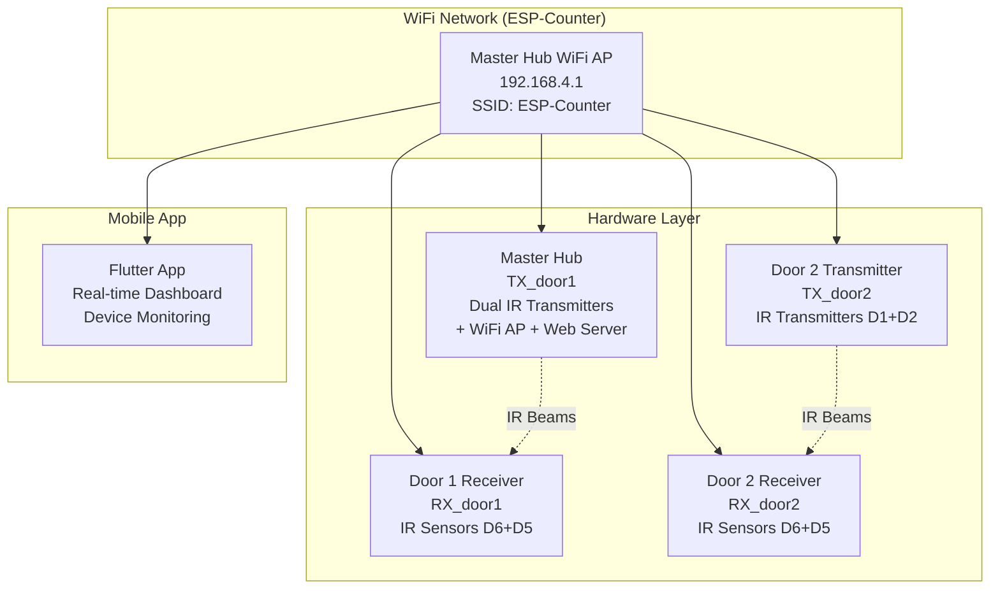
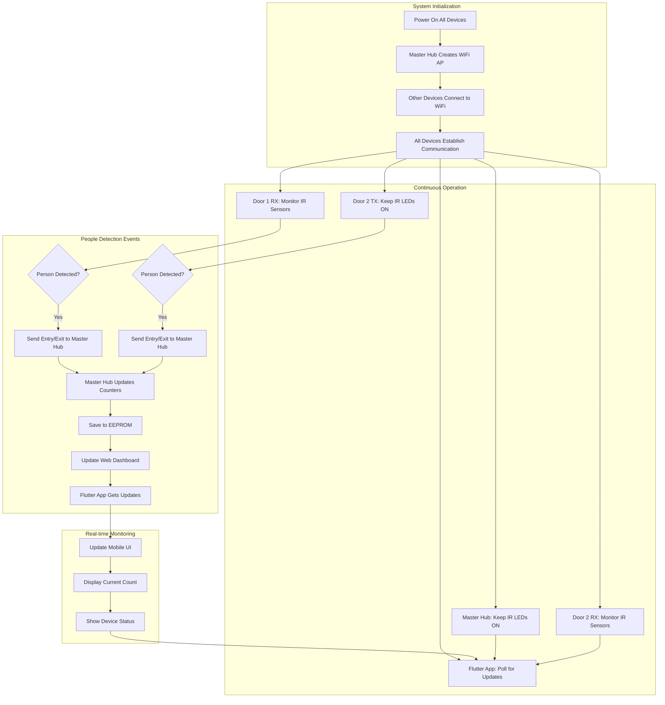
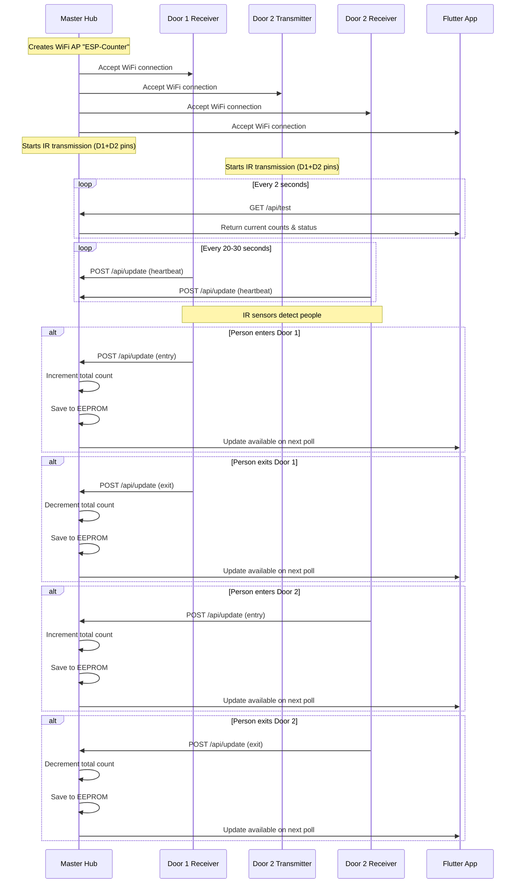
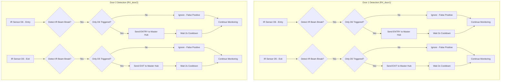
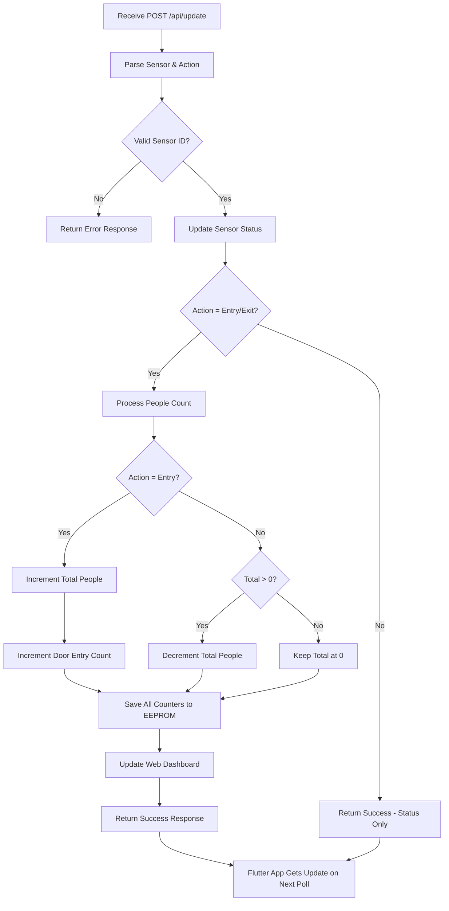
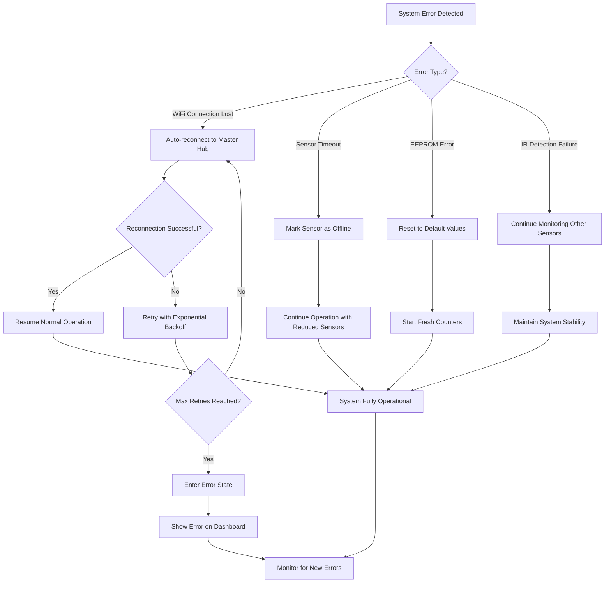

# Complete People Counter Project - System Flowchart

## Project Overview
This is a **Smart IR Detection People Counting System** that uses:
- **4 ESP8266 devices** (2 transmitters + 2 receivers)
- **Flutter mobile app** for real-time monitoring
- **WiFi network** for centralized coordination
- **Bidirectional detection** to prevent false positives

## Complete System Architecture



## Complete System Flow



## Device Communication Flow



## Hardware Detection Logic



## Flutter App Data Flow

```mermaid
flowchart TD
    A[App Starts] --> B[Connect to Master Hub WiFi]
    B --> C{Connection Successful?}
    C -->|Yes| D[Start Polling Timer (2s)]
    C -->|No| E[Show Connection Error]
    
    D --> F[GET /api/test from Master Hub]
    F --> G{Response Received?}
    G -->|Yes| H[Parse JSON Data]
    G -->|No| I[Show Connection Error]
    
    H --> J[Update UI Components]
    J --> K[Display People Count]
    J --> L[Show Device Status]
    J --> M[Update Timestamps]
    
    K --> N[Wait 2 Seconds]
    L --> N
    M --> N
    N --> F
    
    E --> O[Retry Connection]
    I --> O
    O --> B
```

## Master Hub Processing Flow



## Error Handling & Recovery



## Data Flow Summary

| Component | Role | Communication | Frequency |
|-----------|------|---------------|-----------|
| **Master Hub** | WiFi AP + Web Server + IR TX | Creates network, processes data | Continuous |
| **Door 1 RX** | IR Detection + WiFi Client | Sends entry/exit events | On detection + 30s heartbeat |
| **Door 2 TX** | IR Transmission | Keeps IR LEDs ON | Continuous |
| **Door 2 RX** | IR Detection + WiFi Client | Sends entry/exit events | On detection + 30s heartbeat |
| **Flutter App** | Mobile Dashboard | Polls for updates | Every 2 seconds |

## Key System Features

### 1. **Bidirectional Detection**
- Prevents false positives from simultaneous sensor triggers
- 2-second cooldown between detections
- 100ms debounce protection

### 2. **Real-time Communication**
- WiFi network for instant data transmission
- HTTP API for structured communication
- Automatic reconnection on network loss

### 3. **Data Persistence**
- EEPROM storage for counter values
- Automatic data validation
- Recovery from corruption

### 4. **Multi-platform Monitoring**
- Web dashboard on Master Hub
- Flutter mobile app
- Real-time updates across all interfaces

### 5. **Fault Tolerance**
- Automatic WiFi fallback
- Sensor timeout detection
- Graceful degradation on failures

This system provides a **robust, real-time people counting solution** that combines hardware reliability with modern software monitoring, creating a comprehensive solution for traffic analysis and building access tracking.
